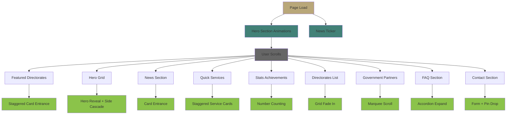

# Government App Homepage Animation Plan

## Executive Summary

This plan outlines recommended animations and motion enhancements for the government portal home page. The focus is on **professional, dignified, and accessible** animations that enhance user experience without being distracting or overwhelming.

---

## Current Animation State Analysis

### Existing Animations

| Component | Current Animation | Status |
|-----------|------------------|--------|
| [`HeroSection`](frontend-next/src/components/HeroSection.tsx) | Logo composition, background reveal, text cascade, breathing/float effects, particles | ✅ Well-implemented |
| [`NewsTicker`](frontend-next/src/components/NewsTicker.tsx) | Seamless scrolling marquee | ✅ Good |
| [`FeaturedDirectorates`](frontend-next/src/components/FeaturedDirectorates.tsx) | Simple fade-up transitions | ⚠️ Basic |
| [`HeroGrid`](frontend-next/src/components/HeroGrid.tsx) | Image scale on hover only | ⚠️ Limited |
| [`NewsSection`](frontend-next/src/components/NewsSection.tsx) | GSAP scroll-triggered card entrance | ✅ Good |
| [`QuickServices`](frontend-next/src/components/QuickServices.tsx) | Hover effects only | ❌ No entrance |
| [`StatsAchievements`](frontend-next/src/components/StatsAchievements.tsx) | Number counting, card entrance | ✅ Good |
| [`GovernmentPartners`](frontend-next/src/components/GovernmentPartners.tsx) | Infinite marquee scroll | ✅ Good |
| [`FAQSection`](frontend-next/src/components/FAQSection.tsx) | Accordion expand/collapse | ✅ Good |

### Missing Animations

- [`QuickServices`](frontend-next/src/components/QuickServices.tsx) - No entrance animations
- [`HeroGrid`](frontend-next/src/components/HeroGrid.tsx) - Needs dynamic entrance
- [`Announcements`](frontend-next/src/components/Announcements.tsx) - Not reviewed, likely needs animations
- [`ComplaintPortal`](frontend-next/src/components/ComplaintPortal.tsx) - Needs form animations
- [`SuggestionsForm`](frontend-next/src/components/SuggestionsForm.tsx) - Needs form animations
- [`DirectoratesList`](frontend-next/src/components/DirectoratesList.tsx) - Needs entrance animations
- [`ContactSection`](frontend-next/src/components/ContactSection.tsx) - Needs entrance animations
- Section headers - Need consistent entrance animations

---

## Government App Animation Principles

### 1. Professional & Dignified
- Avoid playful, bouncy, or cartoonish animations
- Use smooth, elegant easing functions (power2, power3, sine)
- Maintain a sense of authority and trustworthiness

### 2. Subtle & Purposeful
- Animations should serve a purpose (guide attention, indicate state)
- Avoid decorative animations that distract from content
- Keep durations between 300ms-800ms for user actions

### 3. Accessible
- Respect `prefers-reduced-motion` media query
- Provide alternatives for users with motion sensitivities
- Ensure animations don't interfere with screen readers

### 4. Fast & Efficient
- Optimize for performance (use CSS transforms when possible)
- Avoid layout thrashing and reflows
- Test on lower-end devices

### 5. Consistent
- Use consistent easing, durations, and patterns across components
- Establish a design system for animations

---

## Recommended Animations by Section

### 1. QuickServices Section

**Current State:** Only hover effects

**Recommended Animations:**

| Animation Type | Description | Implementation |
|----------------|-------------|----------------|
| **Section Header Fade-In** | Title and badge slide up with fade | GSAP `fadeInUp` |
| **Service Cards Staggered Entrance** | Cards appear one by one from bottom | GSAP `staggerEntrance` |
| **Icon Pulse on Hover** | Subtle scale and glow effect | CSS transform + box-shadow |
| **Arrow Slide on Hover** | Arrow icon slides toward link | CSS translate |

**Motion Style:** 
- Duration: 600ms per card
- Easing: `power2.out`
- Stagger: 100ms between cards

---

### 2. HeroGrid Section

**Current State:** Image scale on hover only

**Recommended Animations:**

| Animation Type | Description | Implementation |
|----------------|-------------|----------------|
| **Main Hero Reveal** | Large hero card scales up with fade | GSAP scale + opacity |
| **Side Items Cascade** | Side articles slide in from sides | GSAP from x-axis |
| **Image Parallax** | Subtle image movement on scroll | GSAP ScrollTrigger |
| **Button Ripple** | Click ripple effect on buttons | GSAP ripple |
| **AI Summary Slide Down** | Summary panel slides down smoothly | CSS max-height transition |

**Motion Style:**
- Main hero: 800ms, `power3.out`
- Side items: 600ms, `power2.out`
- Stagger: 150ms

---

### 3. Complaints & Suggestions Section

**Current State:** No animations

**Recommended Animations:**

| Animation Type | Description | Implementation |
|----------------|-------------|----------------|
| **Section Split Reveal** | Left and right sections slide in from opposite sides | GSAP from x-axis |
| **Form Fields Focus Animation** | Input border expands on focus | CSS transition |
| **Submit Button Loading** | Spinner animation on submit | CSS keyframes |
| **Success Checkmark** | Animated checkmark on success | SVG stroke animation |
| **Form Validation Shake** | Gentle shake on invalid fields | CSS keyframes |

**Motion Style:**
- Section reveal: 700ms, `power2.out`
- Form focus: 300ms, `ease-out`
- Validation shake: 400ms

---

### 4. Announcements Section

**Current State:** Not reviewed

**Recommended Animations:**

| Animation Type | Description | Implementation |
|----------------|-------------|----------------|
| **Badge Pulse** | "New" badge pulses gently | CSS animation |
| **Cards Staggered Entrance** | Cards slide up with fade | GSAP `staggerEntrance` |
| **Priority Indicator Glow** | High-priority items have subtle glow | CSS box-shadow |
| **Date Badge Slide** | Date badge slides in from side | CSS transform |

**Motion Style:**
- Cards: 600ms, `power2.out`
- Stagger: 100ms
- Badge pulse: 2s infinite, `ease-in-out`

---

### 5. DirectoratesList Section

**Current State:** Not reviewed

**Recommended Animations:**

| Animation Type | Description | Implementation |
|----------------|-------------|----------------|
| **Grid Items Fade-In** | Items appear with staggered timing | GSAP `staggerEntrance` |
| **Icon Rotate on Hover** | Icon rotates 15 degrees on hover | CSS transform |
| **Card Lift Effect** | Card lifts slightly on hover | CSS translateY |
| **Category Filter Animation** | Filter buttons slide when active | CSS transform |

**Motion Style:**
- Grid items: 500ms, `power2.out`
- Stagger: 80ms
- Hover: 300ms, `ease-out`

---

### 6. ContactSection

**Current State:** Not reviewed

**Recommended Animations:**

| Animation Type | Description | Implementation |
|----------------|-------------|----------------|
| **Section Header Reveal** | Header slides down with fade | GSAP `fadeInUp` |
| **Contact Cards Entrance** | Cards stagger in from bottom | GSAP `staggerEntrance` |
| **Map Pin Drop** | Location pin drops with bounce | CSS keyframes |
| **Form Input Focus** | Input border animates on focus | CSS transition |
| **Send Button Success** | Button transforms to checkmark | SVG animation |

**Motion Style:**
- Cards: 600ms, `power2.out`
- Stagger: 120ms
- Pin drop: 600ms, `back.out(1.7)`

---

### 7. Section Headers (Global)

**Current State:** Inconsistent

**Recommended Standard Animation:**

| Animation Type | Description | Implementation |
|----------------|-------------|----------------|
| **Badge Fade-In** | Small badge appears first | CSS fade |
| **Title Slide Up** | Main title slides up | GSAP `fadeInUp` |
| **Underline Expand** | Decorative line expands from center | CSS width transition |
| **Description Fade** | Subtitle fades in after title | CSS opacity |

**Motion Style:**
- Badge: 400ms
- Title: 600ms, `power2.out`
- Underline: 500ms, `ease-out`
- Description: 500ms

---

## Animation Library Extensions

### New Functions to Add to [`animations.ts`](frontend-next/src/animations.ts)

```typescript
/**
 * Section Header Animation
 * Badge → Title → Underline → Description
 */
export const sectionHeaderEntrance = (container: HTMLElement) => {
    const tl = gsap.timeline();
    
    tl.from(container.querySelector('.header-badge'), {
        opacity: 0,
        scale: 0.8,
        duration: 0.4,
        ease: 'power2.out'
    })
    .from(container.querySelector('.header-title'), {
        y: 30,
        opacity: 0,
        duration: 0.6,
        ease: 'power2.out'
    }, '-=0.2')
    .from(container.querySelector('.header-underline'), {
        width: 0,
        duration: 0.5,
        ease: 'power2.out'
    }, '-=0.3')
    .from(container.querySelector('.header-description'), {
        opacity: 0,
        y: 10,
        duration: 0.5,
        ease: 'power2.out'
    }, '-=0.3');
    
    return tl;
};

/**
 * Card Lift on Hover
 */
export const cardLift = (element: HTMLElement) => {
    element.addEventListener('mouseenter', () => {
        gsap.to(element, {
            y: -8,
            boxShadow: '0 20px 40px rgba(0,0,0,0.1)',
            duration: 0.3,
            ease: 'power2.out'
        });
    });
    
    element.addEventListener('mouseleave', () => {
        gsap.to(element, {
            y: 0,
            boxShadow: '0 4px 12px rgba(0,0,0,0.05)',
            duration: 0.3,
            ease: 'power2.out'
        });
    });
};

/**
 * Icon Rotate on Hover
 */
export const iconRotate = (element: HTMLElement) => {
    element.addEventListener('mouseenter', () => {
        gsap.to(element, {
            rotation: 15,
            duration: 0.3,
            ease: 'back.out(1.7)'
        });
    });
    
    element.addEventListener('mouseleave', () => {
        gsap.to(element, {
            rotation: 0,
            duration: 0.3,
            ease: 'power2.out'
        });
    });
};

/**
 * Form Field Focus Animation
 */
export const formFieldFocus = (element: HTMLInputElement | HTMLTextAreaElement) => {
    element.addEventListener('focus', () => {
        gsap.to(element, {
            borderColor: '#428177',
            boxShadow: '0 0 0 3px rgba(66, 129, 119, 0.1)',
            duration: 0.3,
            ease: 'power2.out'
        });
    });
    
    element.addEventListener('blur', () => {
        gsap.to(element, {
            borderColor: '#e5e7eb',
            boxShadow: 'none',
            duration: 0.3,
            ease: 'power2.out'
        });
    });
};

/**
 * Checkmark Animation for Success States
 */
export const checkmarkAnimate = (element: SVGElement) => {
    const path = element.querySelector('path');
    if (!path) return;
    
    gsap.set(path, {
        strokeDasharray: path.getTotalLength(),
        strokeDashoffset: path.getTotalLength()
    });
    
    return gsap.to(path, {
        strokeDashoffset: 0,
        duration: 0.6,
        ease: 'power2.out'
    });
};

/**
 * Pin Drop Animation
 */
export const pinDrop = (element: HTMLElement) => {
    return gsap.fromTo(element,
        { y: -100, opacity: 0, rotation: -10 },
        { 
            y: 0, 
            opacity: 1, 
            rotation: 0,
            duration: 0.6, 
            ease: 'back.out(1.7)' 
        }
    );
};

/**
 * Badge Pulse Animation
 */
export const badgePulse = (element: HTMLElement) => {
    return gsap.to(element, {
        scale: 1.1,
        boxShadow: '0 0 20px rgba(200, 16, 46, 0.4)',
        duration: 1,
        repeat: -1,
        yoyo: true,
        ease: 'sine.inOut'
    });
};
```

---

## CSS Animations to Add to [`globals.css`](frontend-next/src/app/globals.css)

```css
/* --- Animation Keyframes --- */

/* Gentle Pulse for Badges */
@keyframes badge-pulse {
    0%, 100% {
        transform: scale(1);
        box-shadow: 0 0 10px rgba(200, 16, 46, 0.3);
    }
    50% {
        transform: scale(1.05);
        box-shadow: 0 0 20px rgba(200, 16, 46, 0.5);
    }
}

/* Form Validation Shake */
@keyframes shake {
    0%, 100% { transform: translateX(0); }
    20% { transform: translateX(-5px); }
    40% { transform: translateX(5px); }
    60% { transform: translateX(-3px); }
    80% { transform: translateX(3px); }
}

/* Loading Spinner */
@keyframes spin {
    from { transform: rotate(0deg); }
    to { transform: rotate(360deg); }
}

/* Fade In Up */
@keyframes fade-in-up {
    from {
        opacity: 0;
        transform: translateY(20px);
    }
    to {
        opacity: 1;
        transform: translateY(0);
    }
}

/* Underline Expand */
@keyframes underline-expand {
    from { width: 0; }
    to { width: 100%; }
}

/* --- Utility Classes --- */

.animate-badge-pulse {
    animation: badge-pulse 2s ease-in-out infinite;
}

.animate-shake {
    animation: shake 0.4s ease-in-out;
}

.animate-spin {
    animation: spin 1s linear infinite;
}

.animate-fade-in-up {
    animation: fade-in-up 0.6s ease-out forwards;
}

/* --- Reduced Motion Support --- */
@media (prefers-reduced-motion: reduce) {
    *,
    *::before,
    *::after {
        animation-duration: 0.01ms !important;
        animation-iteration-count: 1 !important;
        transition-duration: 0.01ms !important;
    }
}
```

---

## Implementation Priority

### Phase 1: High Impact, Low Effort
1. ✅ [`QuickServices`](frontend-next/src/components/QuickServices.tsx) - Staggered card entrance
2. ✅ [`HeroGrid`](frontend-next/src/components/HeroGrid.tsx) - Dynamic entrance animations
3. ✅ Section headers - Standardized animation pattern

### Phase 2: Medium Impact, Medium Effort
4. ✅ [`Announcements`](frontend-next/src/components/Announcements.tsx) - Card animations
5. ✅ [`DirectoratesList`](frontend-next/src/components/DirectoratesList.tsx) - Grid entrance
6. ✅ [`ContactSection`](frontend-next/src/components/ContactSection.tsx) - Form animations

### Phase 3: High Impact, High Effort
7. ✅ [`ComplaintPortal`](frontend-next/src/components/ComplaintPortal.tsx) - Form interactions
8. ✅ [`SuggestionsForm`](frontend-next/src/components/SuggestionsForm.tsx) - Form interactions
9. ✅ Global page transitions

---

## Performance Considerations

1. **Use CSS Transforms** for hover effects (GPU accelerated)
2. **Debounce Scroll Events** for scroll-triggered animations
3. **Use `will-change`** sparingly and only when needed
4. **Test on Mobile** - Ensure animations perform well on lower-end devices
5. **Lazy Load Animations** - Only trigger when element enters viewport

---

## Accessibility Guidelines

1. **Respect `prefers-reduced-motion`** - Disable animations for users who prefer reduced motion
2. **Provide Visual Feedback** - Ensure animations don't hide important information
3. **Maintain Focus Indicators** - Don't remove focus styles during animations
4. **Keep Animations Under Control** - Allow users to pause/disable animations
5. **Test with Screen Readers** - Ensure animations don't interfere with assistive technology

---

## Testing Checklist

- [ ] All animations respect `prefers-reduced-motion`
- [ ] Animations don't cause layout shifts
- [ ] Hover states work on touch devices
- [ ] Loading states are clear
- [ ] Form validation feedback is visible
- [ ] Animations don't interfere with keyboard navigation
- [ ] Performance is acceptable on mobile devices
- [ ] Animations are consistent across the site

---

## Mermaid Diagram: Animation Flow



---

## Conclusion

This animation plan provides a comprehensive approach to adding motion to the government portal home page while maintaining professionalism, accessibility, and performance. The recommended animations enhance user experience without being distracting or overwhelming.

The phased implementation approach allows for incremental improvements, starting with high-impact, low-effort animations and progressing to more complex interactions.
